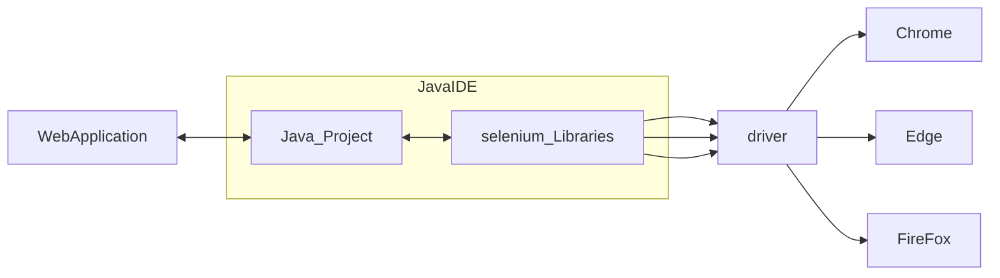

# **TUTORiAL** Selenium:

## Context:
   1. [Components of selenium](#components-of-selenium)
        1. [Selenium IDE (Integrated Development Environment )](#1-selenium-ide)
        2. [Selenium RC( Remote Control )](#2-selenium-rc)
        3. [Selenium WebDriver](#3-selenium-webdriver)
        4. [Selenium Grid](#4-selenium-grid)
   2. [Selenium Project and Driver](#2-selenium-project-and-driver)


*1. **Selenium is a open Source UI automation tool.*  
2. Selenium is used to automate the web-application**


    
  > **Note:** Selenium is not used for Desk-top based application.


# Components of Selenium: 
   > selenium is not just a tool its a package _(having lot of tools)_.
   
   Tool's of Selenium:
   1. [Selenium IDE (Integrated Development Environment )](#1-selenium-ide)
   2. [Selenium RC(Remote Control)](#2-selenium-rc)
   3. [Selenium WebDriver](#3-selenium-webdriver)
   4. [Selenium Grid](#4-selenium-grid)
   
   # 1. Selenium IDE
   1. *Selenium IDE is just an record and play tool*
   1. *Selenium IDE is Browser plugin which is compatible with Mozilla FireFox only.*
   2. *User is not allowed to put condition in IDE*
   
   # 2. Selenium RC
   1. *Selenium RC stands for Remote control*
   2. *Selenium RC is a automated web testing tool that allow user to use their programming language.*
   
   #### Pros and Cons of selenium RC
   
                
| Pros                                                    | Cons                                                      |
|---------------------------------------------------------|---------------------|
| Cross Browser and Platform                              | More Complicated than IDE                                 |
| Perform Loops and conditional Statement                 | Programming knowledge is must                             |
| Data driven test cases are possible                     | Selenium RC server needs to be run to start the execution |
| Can support multiple browser and is faster than the IDE | Slow than WebDriver Poor support of JS.                   |


# 3. Selenium WebDriver
:point_right: Selenium WebDriver is better than RC and IDE  
:point_right: Selenium WebDiver is more Stable than RC  
:point_right: WebDriver unlike RC does not rely on JS for automation **It controls the browser by directly communicating with it**  
:point_right: WD also supports multiple programming language.

# 4. Selenium Grid
   > **Note**: Selenium Grid is used to execute the script and not write Script
   
   1. It is a tool used for parallel execution.(like executing 10 script at once)
   2. Selenium grid is compatible with RC and WD both.
   3. It works as an execution engine for Selenium tests.
   4. Enables simultaneous running of tests in multiple browser and environments.
        (For eg. We want the test case to run on windows on mac and linux then that is possible with Grid)
        (For eg. we want to test the case in Chrome and the Safari and then fireFox then this can be done in one go instead of running them one by one)
        
   

###### 2. Selenium Project and Driver
   > :bulb: Selenium comes in multiple jar's called as **Selenium Project**
   
   > :brain: We need ***Driver*** to execute script in a particular browser.




# 3. First Test Case in Selenium

To open url we have to create object of **WebDriver** 
use the driver insite the system property //inside System.setProperty(Webdrive.)
> :bulb: Note:- **WebDriver is interface in selenium**  

> :brain: NOTE:- ***ChromeDrive,EdgeDriver,SafariDriver are class which are implementing the WebDriver interface.***
#### Test Verify Facebook HomePage. 

* **
* **Task 1**: *Open the facebook home page*  
* **Task 2**: *Verify the page title*

```java
import org.openqa.selenium.WebDriver;
import org.openqa.selenium.edge.EdgeDriver;
import org.testng.Assert;
import org.testng.annotations.Test;

public class FirstSeleniumPage {

    @Test
    public void VerifyFacebookHomePage(){

/*      Task1: Open the FaceBook Home Page
        Task2: Verify the page Title
* */


        String url = "https://www.facebook.com/";

        // Open the URL with Selenium
        System.setProperty("webdriver.edge.driver","F:\\Java\\Selinum\\msedgedriver.exe");
        WebDriver driver = new EdgeDriver();
//        To Maximize browser
        driver.manage().window().maximize();
        driver.get(url);

//        Verify the page Title
        String title = driver.getTitle();
        System.out.println("Page Title: "+title);
        Assert.assertEquals(title,"Facebook – log in or sign up");

//        To Close the Browser
        driver.close();
    }

}
```
